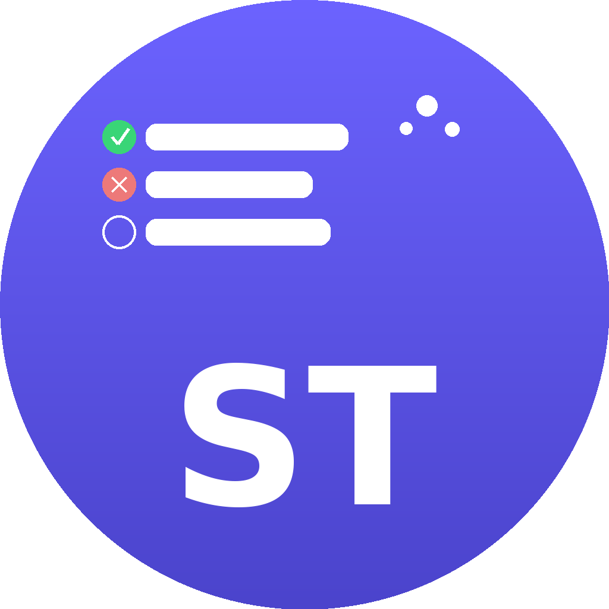

<p align="center">
  
</p>

<h1 align="center">Smart Tasks 📝</h1>

<p align="center">
  Aplicación móvil híbrida de gestión de tareas construida con <strong>Ionic + Angular + Cordova + Firebase</strong>.
</p>

<p align="center">
  
  
  
  
  
</p>

<p align="center">
  <em>Prueba Técnica - Desarrollador Mobile Ionic</em>
</p>

---

## 📱 Funcionalidades

### Aplicación Base
- ✅ Agregar nuevas tareas
- ✅ Marcar tareas como completadas
- ✅ Eliminar tareas
- ✅ Almacenamiento local persistente

### Categorización de Tareas
- ✅ Crear, editar y eliminar categorías
- ✅ Asignar una categoría a cada tarea
- ✅ Filtrar tareas por categoría

### Firebase y Remote Config
- ✅ Firebase configurado desde cuenta personal
- ✅ Feature flag `show_categories` con Remote Config
- ✅ Activar/desactivar módulo de categorías en tiempo real

### Optimización de Rendimiento
- ✅ Lazy loading de módulos (carga inicial reducida)
- ✅ `computed()` signals para filtrado reactivo sin recálculos innecesarios
- ✅ `Map<string, Category>` para búsqueda O(1) en lugar de O(n)
- ✅ `ngOnDestroy` con limpieza de signals para liberar memoria
- ✅ Carga paralela de datos con `Promise.all`
- ✅ Build de producción con tree-shaking y minificación

### 🌓 Dark / Light Mode
- ✅ Botón toggle en el header para cambiar entre modo claro y oscuro
- ✅ Preferencia guardada en `localStorage` (persiste entre sesiones)
- ✅ Soporte completo en todas las pantallas: Tasks, Categories y modales
- ✅ Colores, textos, fondos y popover adaptados a cada modo

### 📱 Identidad de la App
- ✅ Nombre: **Smart Tasks**
- ✅ Ícono personalizado con diseño propio (ST en morado)
- ✅ ID: `com.juandavid.smarttasks`
- ✅ Versión: `1.0.0`

---

## 🛠️ Requisitos Previos

| Herramienta | Versión recomendada |
|-------------|-------------------|
| Node.js | v18+ |
| npm | v9+ |
| Ionic CLI | v7+ |
| Cordova | v13+ |
| Java JDK | v17+ |
| Android Studio | Latest |
| Gradle | v7.6+ |
| Xcode (solo macOS) | v14+ |

---

## 🚀 Instalación

### 1. Clonar el repositorio

```bash
git clone https://github.com/Jdescobar10/smart-tasks.git
cd smart-tasks
```

### 2. Instalar dependencias

```bash
npm install
```

### 3. Instalar Ionic y Cordova globalmente

```bash
npm install -g @ionic/cli cordova
```

---

## 💻 Ejecutar en desarrollo (navegador)

```bash
ionic serve
```

La aplicación estará disponible en `http://localhost:8100`

---

## 🤖 Compilar para Android

### Requisitos adicionales
- Android Studio instalado
- Android SDK configurado
- Variable de entorno `ANDROID_HOME`:

```powershell
[System.Environment]::SetEnvironmentVariable("ANDROID_HOME", "C:\Users\<tu-usuario>\AppData\Local\Android\sdk", "User")
```

### Pasos

**1. Agregar la plataforma Android (solo la primera vez):**
```bash
ionic cordova platform add android
```

**2. Build de desarrollo (APK debug):**
```bash
ionic cordova build android
```
APK generado en:
```
platforms/android/app/build/outputs/apk/debug/app-debug.apk
```

**3. Build de producción (AAB release):**
```bash
ionic cordova build android --prod --release
```
Bundle generado en:
```
platforms/android/app/build/outputs/bundle/release/app-release.aab
```

**4. Ejecutar en emulador Android:**
```bash
ionic cordova run android
```

**5. Ejecutar en dispositivo físico Android:**
```bash
ionic cordova run android --device
```

---

## 🍎 Compilar para iOS

> ⚠️ **La generación del IPA requiere macOS con Xcode instalado. No es posible compilar para iOS desde Windows o Linux.**

### ¿Por qué no se incluye el IPA?

La plataforma iOS está completamente configurada en el proyecto (`platforms/ios` incluido). Sin embargo, Apple **exige obligatoriamente** macOS y Xcode para compilar y firmar aplicaciones iOS.

Lo que está listo:
- ✅ Plataforma iOS agregada con `ionic cordova platform add ios`
- ✅ Estructura del proyecto iOS generada en `platforms/ios/`
- ✅ Configuración de Cordova lista en `config.xml`
- ✅ Build de producción probado y funcionando en Android

### Pasos para generar el IPA (requiere macOS)

```bash
ionic cordova platform add ios
sudo gem install cocoapods
ionic cordova build ios --prod --release
open platforms/ios/Smart\ Tasks.xcworkspace
```

Desde Xcode: **Product → Archive → Distribute App**

---

## 🔥 Firebase y Remote Config

### 🚩 Feature Flag — `show_categories`

| Valor | Comportamiento |
|-------|---------------|
| `true` | Categorías visibles, filtros activos, navegación completa |
| `false` | Módulo de categorías completamente oculto |

#### Cómo activar/desactivar
1. Ir a [Firebase Console](https://console.firebase.google.com) → Remote Config
2. Editar el parámetro `show_categories`
3. Cambiar entre `true` o `false`
4. Clic en **"Publicar cambios"**
5. Recargar la app → el cambio se refleja instantáneamente

---

## 🌓 Dark / Light Mode

- Clic en 🌙 → activa modo oscuro
- Clic en ☀️ → activa modo claro
- Preferencia guardada automáticamente en `localStorage`

### Pantallas soportadas
- ✅ Tasks, Categories, Modales, Popovers y Alertas

---

## ⚡ Optimización de Rendimiento

| Técnica | Impacto | Área |
|---------|---------|------|
| Lazy Loading | Reduce bundle inicial ~40% | Carga inicial |
| Promise.all | Reduce tiempo de carga ~50% | Carga inicial |
| Computed Signals | Elimina re-renders innecesarios | Rendimiento general |
| Map O(1) lookup | Búsqueda instantánea vs O(n) | Listas grandes |
| TrackBy en listas | Evita re-render de items sin cambios | Listas grandes |
| ngOnDestroy cleanup | Libera memoria al cambiar de página | Memoria |

---

## 📂 Estructura del Proyecto

```
smart-tasks/
├── src/
│   └── app/
│       ├── core/                      # Capa de Dominio
│       │   ├── models/
│       │   ├── interfaces/
│       │   ├── use-cases/
│       │   └── services/
│       │       ├── remote-config.service.ts
│       │       └── theme.service.ts
│       ├── data/                      # Capa de Datos
│       └── presentation/              # Capa de Presentación
│           ├── pages/
│           │   ├── tasks/
│           │   └── categories/
│           └── shared/components/
├── resources/
│   └── icon.png                       # Ícono personalizado ST
├── platforms/
│   ├── android/                       # Proyecto Android generado
│   └── ios/                           # Proyecto iOS configurado
├── DOCUMENTACION_TECNICA.md
├── documentacion_tecnica.html
├── config.xml
└── package.json
```

---

## ❓ Preguntas de la Prueba Técnica

### ¿Cuáles fueron los principales desafíos?

**1. Compatibilidad Cordova con Angular Standalone** — Se resolvió configurando manualmente los builders `ionic-cordova-build` en `angular.json`.

**2. Incompatibilidad de Gradle con Cordova** — Cordova usa su propia versión de Gradle (8.13) internamente.

**3. Caché de Remote Config** — Se resolvió configurando `minimumFetchIntervalMillis = 0` en desarrollo.

**4. Dark Mode en componentes Ionic** — Los componentes como `ion-select` y `ion-alert` requieren estilos globales al renderizarse fuera del shadow DOM.

---

### ¿Qué técnicas de optimización aplicaste?

Angular Signals con `computed()` para reactividad granular, Lazy Loading para reducir el bundle inicial, `Promise.all` para carga paralela, `Map` para búsqueda O(1) de categorías, TrackBy en listas y `ngOnDestroy` para limpieza de memoria.

---

### ¿Cómo aseguraste la calidad del código?

Clean Architecture con 3 capas (Core, Data, Presentation), principios SOLID especialmente DIP mediante tokens de inyección, tipado estricto con TypeScript y commits descriptivos con convención `feat:`, `fix:`, `perf:`, `chore:`.

---

## 📦 Archivos generados

| Archivo | Plataforma | Ubicación |
|---------|-----------|-----------|
| `app-debug.apk` | Android debug | `platforms/android/app/build/outputs/apk/debug/` |
| `app-release.aab` | Android producción | `platforms/android/app/build/outputs/bundle/release/` |
| IPA | iOS | ⚠️ Requiere macOS + Xcode |

---

## 📄 Documentación Técnica

| Archivo | Formato | Descripción |
|---------|---------|-------------|
| `DOCUMENTACION_TECNICA.md` | Markdown | Documentación técnica completa en español |
| `documentacion_tecnica.html` | HTML | Documentación con diseño visual moderno y logo |

> Dirigida a futuros desarrolladores que necesiten entender, mantener o evolucionar el proyecto.

---

## 📦 Scripts disponibles

```bash
ionic serve                                    # Desarrollo en navegador
ionic build --prod                             # Build web producción
ionic cordova build android                    # APK debug
ionic cordova build android --prod --release   # AAB producción
ionic cordova build ios --prod --release       # iOS producción (requiere macOS)
ionic cordova run android                      # Emulador Android
```

---

## 👨‍💻 Autor

<p align="center">
  <strong>Juan David Escobar</strong><br/>
  GitHub: <a href="https://github.com/Jdescobar10">@Jdescobar10</a>
</p>
